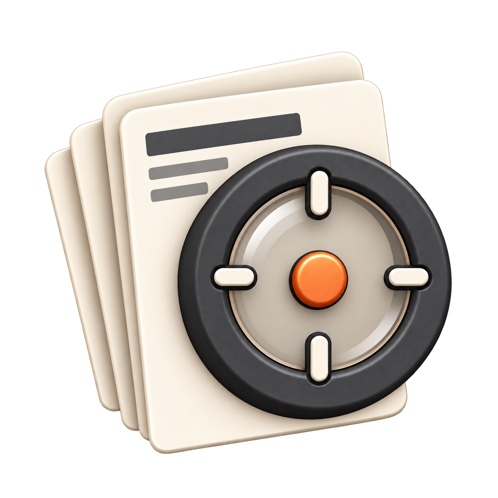

# Research Tracker

Research Tracker is an archive for research topics. 
Each week, an AI agent searches for meaningful new work and saves it in a concise, structured record: links to original sources, short assessments grouped by relevance and ranked by importance, and monthly and yearly reviews of what changed. 

[Website (placeholder; not live yet)](https://your-username.github.io/research-tracker/)

## How it works

Give the repository to an AI agent, tell it to follow the repository rules, define a research topic, and set an external weekly schedule with it. 
The agent then populates the archive: each run creates a session log showing what it searched, found, and excluded. 
It checks the [source registry](web/_data/sources.yml) and searches beyond it. 
Meaningful findings go into weekly reports with source links, short reviews, evidence, and limitations. 
Monthly and yearly reports synthesize important developments and changes in confidence. 
The Markdown archive is also rendered as a website for browsing projects and reports. 

The project is open source and self-hostable. 
Code is MIT licensed; original research notes and site imagery are CC BY 4.0. 
See [rights and licenses](web/rights.html). 

## How to use it

1. Give the repository to an AI agent and tell it to follow all repository rules, starting with [AGENTS.md](AGENTS.md) and the [writing guide](docs/writing-guide.md). 
2. Define your research topic with the agent: its question, scope, and criteria for including work. 
   Record these in a project file like [this one](topics/zero-order-training/topic.md). 
3. Agree on a weekly day, time, and timezone, and have the agent follow the [setup and recurring-run instructions](docs/agent-workflow.md) to configure its external scheduler. 
   If scheduling is unavailable, use the same instructions to run it manually each week. 
   Have it produce monthly and yearly reviews when those periods end. 
   The repository stores the work; it does not run the agent itself. 
4. Read the reports in the repository or on the website. 
   Open source links for the original work and session links to check the search trail. 

## Repository map

- `topics/<project>/topic.md` — research question and inclusion rules. 
- `topics/<project>/sessions/` — record of each research pass. 
- `topics/<project>/reports/` — weekly assessments and monthly or yearly syntheses. 
- `web/` — the website and shared source registry. 
- `templates/` and `docs/writing-guide.md` — formats and detailed authoring rules. 

For local preview, validation, and publishing, see the [development guide](docs/development.md). 
