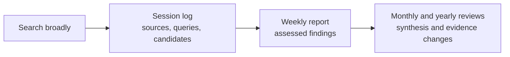

# Research Tracker

**A source-linked record of what research appeared, what holds up, and what matters.** Each search creates a session log; meaningful results become weekly assessments; monthly and yearly reviews explain the larger picture. A period with no qualifying findings stays brief and honest.

[Website (placeholder; not live yet)](https://your-username.github.io/research-tracker/)

## How it works

The [source registry](web/_data/sources.yml) is a minimum checklist, **not a limit on search**. Only work that materially informs the topic belongs in a report. Every search session gets its own Markdown file, even when nothing qualifies.

## Inside the repository

- **Projects** define each research question and its inclusion rules.
- **Sessions** record every search, including quiet ones.
- **Reports** assess weekly findings and synthesize monthly and yearly changes.
- **Sources and templates** keep coverage and writing consistent.
- **`web/`** holds the website pages, layout, source registry, and styling.
