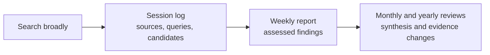

# Research Tracker

**A source-linked record of what research appeared, what holds up, and what matters.** Each search creates a session log; meaningful results become weekly assessments; monthly and yearly reviews explain the larger picture. A period with no qualifying findings stays brief and honest.

[Website (placeholder; not live yet)](https://your-username.github.io/research-tracker/) · [September 2026 example](topics/zero-order-training/reports/monthly/2026-09.md)

## How it works



The [source registry](_data/sources.yml) is a minimum checklist, **not a limit on search**. Only work that materially informs the topic belongs in a report. Every search session gets its own Markdown file, even when nothing qualifies.

## Repository map

```text
topics/<topic>/topic.md         Scope and inclusion rules
topics/<topic>/sessions/        One Markdown file per search
topics/<topic>/reports/         Weekly, monthly, yearly Markdown reviews
_data/sources.yml              Shared source checklist
templates/                     Formats for sessions and reports
docs/writing-guide.md          Detailed rules and field definitions
```

Start with the [agent workflow](AGENTS.md), [ZO topic](topics/zero-order-training/topic.md), and [writing guide](docs/writing-guide.md). The [September example](topics/zero-order-training/reports/monthly/2026-09.md) links to its weekly reports and [search session](topics/zero-order-training/sessions/2026-10-06T141730Z.md); it is a partial retrospective backfill.

The website is a GitHub Pages view of these files. It will be available after the repository is published and Pages is enabled.
